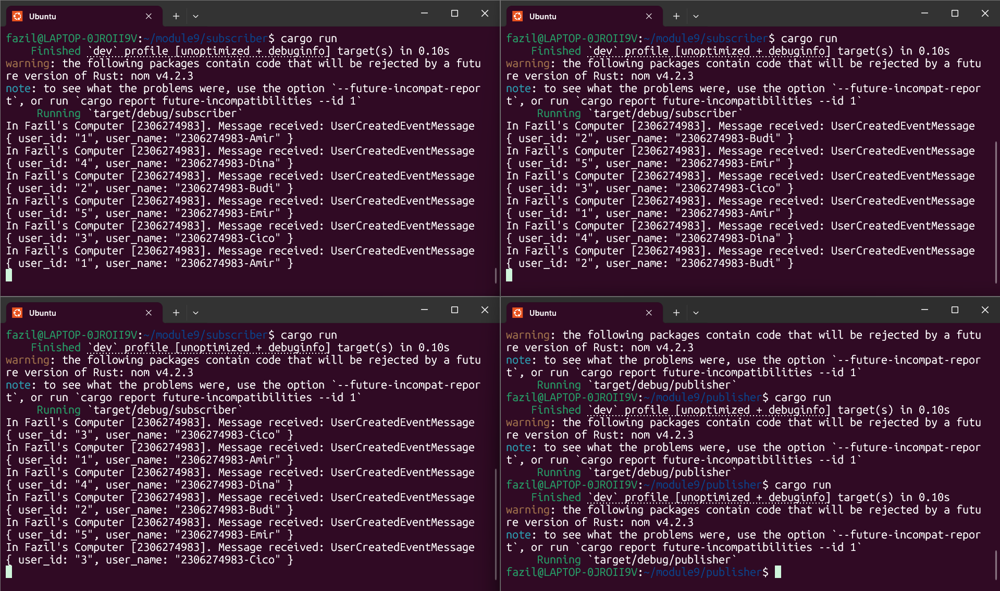
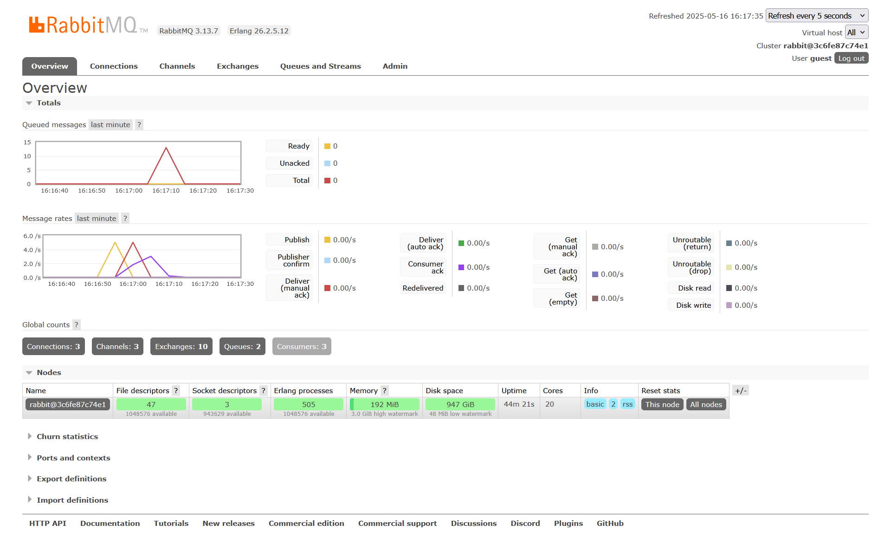

## What is AMQP?

AMQP (Advanced Message Queuing Protocol) is an open standard application layer protocol for message-oriented middleware. It defines a binary, peer-to-peer protocol for reliable, secure, and interoperable messaging between systems. AMQP provides features like message orientation, queuing, routing (including point-to-point and publish/subscribe), reliability, and security.

---

## Explanation of `guest:guest@localhost:5672`

* **First `guest`**: the username used to authenticate with the AMQP broker (RabbitMQ by default).
* **Second `guest`**: the corresponding password for that user.
* **`localhost:5672`**: the network address and port of the AMQP broker. Here, `localhost` means the broker is running on the same machine, and `5672` is the default port on which RabbitMQ listens for AMQP connections.

---

## Reflection and Running at least three subscribers

To simulate real-world scenarios where some subscribers are slow, we introduced a 1-second delay (`thread::sleep`) inside the subscriber’s `handle` function. Then, we opened multiple terminals and started several subscriber instances to distribute the processing load.

### Console Output from Multiple Subscribers

You can observe that the subscribers are **sharing the workload**. Different messages are processed by different instances. This behavior reflects the power of event-driven architecture with scalable consumers.

### RabbitMQ Queue Metrics

RabbitMQ’s dashboard shows:

- A **spike** in the `Queued messages` chart when messages are produced quickly and subscribers are too slow to process them.
- With **multiple subscribers**, that spike **drops faster**, as messages are dequeued and acknowledged in parallel.

---

## Why this matters

With only one slow subscriber, the queue backs up quickly. But by launching 3 subscribers, we significantly improve throughput and prevent the queue from growing out of control. This is exactly how real distributed systems achieve scalability—by adding more consumers as demand rises.

---

## Thoughts for Improvement

- We could **configure prefetch limits** to better balance message delivery.
- Implementing **metrics logging** could help profile processing time more accurately.
- Eventually, we might want to **persist** messages or use a **dedicated worker pool** for better observability and fault tolerance.
